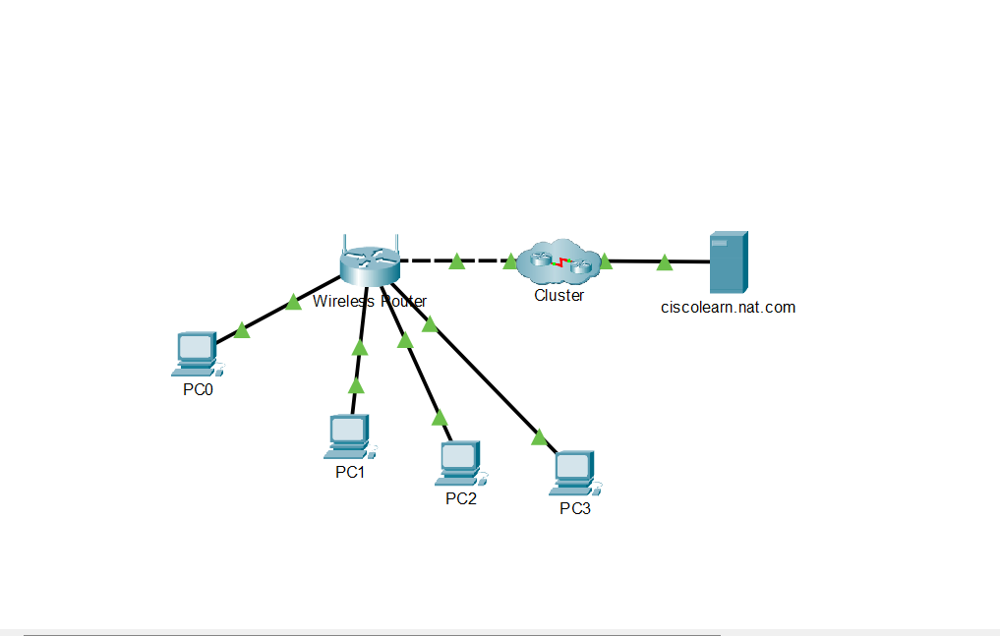

# NAT Configuration and Packet Translation on a Wireless Router

A hands-on Cisco Packet Tracer lab focused on examining Network Address Translation (NAT) and observing how private IP addresses are translated when traffic passes through a wireless router.

## 🛠️ Lab Environment

- **Tool:** Cisco Packet Tracer
- **Network Device:** Wireless Router
- **End Devices:** 4 PCs
- **External Network:** ISP / simulated Internet server
- **Protocol:** NAT
- **IP Version:** IPv4
- **Traffic Tested:** HTTP / TCP

## 🎯 Objectives

- Examine the NAT configuration of a wireless router
- Configure PCs to obtain IPv4 addresses through DHCP
- Identify private and public IP addresses
- Observe traffic moving between an internal network and an external network
- Examine packet headers before and after NAT translation
- Identify changes to the source IP address during NAT
- Verify network communication through simulation mode

## ⚙️ Network Configuration

The PCs were connected to the wireless router and configured to obtain their IPv4 addresses automatically through DHCP.

The router provides the internal network with private IPv4 addresses, while its Internet-facing interface uses an address assigned by the simulated ISP.

The NAT process allows devices using private IP addresses on the internal network to communicate with an external network.

## 🔄 NAT Packet Translation

Packet details were examined in Cisco Packet Tracer's Simulation Mode.

The packet headers were compared before and after passing through the wireless router.

### Before NAT

The outbound packet from the internal PC contains the **private IP address of the PC as the source address**.

### After NAT

When the packet passes through the wireless router, the **source IP address is translated** before the packet continues toward the external server.

This demonstrates how NAT allows multiple devices on a private network to communicate with external networks using the router's Internet-facing address.

## 🔍 What Was Observed

The packet headers were inspected using the **Inbound PDU Details** and **Outbound PDU Details** sections.

The comparison showed:

- The internal PC uses a private IPv4 address.
- The router receives the packet from the internal network.
- NAT changes the source IP address as the packet leaves the private network.
- The destination IP remains directed toward the external server.
- Return traffic can be translated back so the original internal device can receive the response.

## 📚 Skills Practiced

- Network Address Translation (NAT)
- Private vs. public IPv4 addresses
- DHCP
- IPv4 addressing
- Packet analysis
- TCP/HTTP traffic
- Inbound and outbound PDU inspection
- Cisco Packet Tracer Simulation Mode
- Understanding source IP translation
- Basic network communication analysis

## 💡 Key Takeaways

This lab provided a practical demonstration of how NAT operates between a private internal network and an external network.

Instead of only studying NAT theoretically, I was able to inspect the actual packet headers and observe how the source IP address changes as traffic passes through the wireless router.

This helped reinforce the relationship between **private addressing, public addressing, routers, and NAT translation**.

## 🖼️ Screenshots

### Network Topology

### Packet Before NAT Translation

### Packet After NAT Translation

## 📁 Lab File

The completed Packet Tracer topology is included in this directory:

`nat-wireless-router.pkt`

> This repository contains my own documentation, screenshots, and completed Packet Tracer topology. Cisco course instructions are not reproduced here.

## 🚀 Learning Progress

This lab is part of my ongoing journey toward building practical skills in:

**Networking → IT Infrastructure → Cloud → Cybersecurity**
