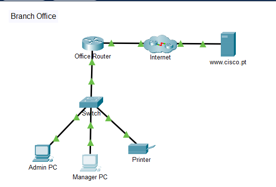
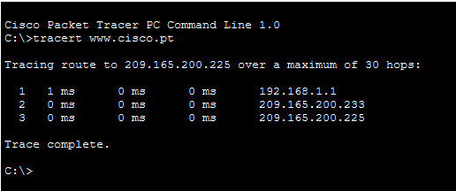

# Create a LAN

A hands-on Cisco Packet Tracer lab focused on building a small branch-office LAN, configuring IPv4 addressing, verifying connectivity, and using basic networking commands to inspect host and network information.

## 🛠️ Lab Environment

- **Tool:** Cisco Packet Tracer
- **Network Device:** Office Router
- **Switch:** Office Switch
- **End Devices:** Admin PC, Manager PC, Printer
- **External Network:** ISP / Internet Server
- **IP Version:** IPv4
- **Address Assignment:** DHCP and Static IPv4

## 🎯 Objectives

- Connect network devices and end hosts
- Configure end devices with IPv4 addressing
- Use DHCP for automatic IP configuration
- Configure a static IPv4 address for a printer
- Verify local network connectivity
- Verify connectivity to a remote server
- Use `ipconfig` and `ipconfig /all` to inspect host information
- Use `tracert` to observe the path to a remote destination
- Understand the role of DNS in accessing resources by hostname

## 🌐 Network Topology

The LAN was built around an office router and switch, connecting two PCs and a network printer.

The office router provides connectivity between the local LAN and the external network.

## ⚙️ IPv4 Configuration

The Admin PC and Manager PC were configured to obtain their IPv4 addressing information dynamically using DHCP.

The printer was configured with a static IPv4 address so that its address remains consistent for devices that need to access it.

| Device | Addressing | IPv4 Address |
|---|---|---|
| Admin PC | DHCP | Dynamically assigned |
| Manager PC | DHCP | Dynamically assigned |
| Printer | Static | `192.168.1.100` |
| Internet Server | Static | `209.165.200.225` |

The PCs received addresses from the `192.168.1.0/24` network, along with the appropriate default gateway and DNS server information from DHCP.

## 🔍 Connectivity Verification

Connectivity between the PCs and the printer was tested using `ping`.

Successful ping responses confirmed that the devices were correctly connected, powered on, and configured within the same IPv4 network.

Connectivity to the remote server was then tested using both its IPv4 address and hostname.

This demonstrated the difference between accessing a resource directly by IP address and resolving a hostname through DNS.

## 🧪 Network Commands

### `ipconfig`

The `ipconfig` command was used to view the IPv4 configuration of a host, including:

- IPv4 address
- Subnet mask
- Default gateway

The `ipconfig /all` command provided additional information such as:

- MAC address
- DHCP status
- DHCP server
- DNS server
- Lease information

This provided a practical way to inspect how a host receives and uses its network configuration.

### `tracert`

The `tracert` command was used to trace the path from a local PC toward the remote web server.

The output showed the intermediate routers that packets passed through before reaching the remote destination.

This helped reinforce how traffic moves beyond the local LAN and how routers act as Layer 3 forwarding devices between different networks.

## 🌍 DNS and Hostname Resolution

The remote server could be reached using its IPv4 address as well as its hostname.

If a server can be reached by IP address but not by its URL, the network connection itself may be working while DNS name resolution is failing.

This demonstrates the role of DNS in translating human-readable hostnames into IP addresses.

## 📚 Skills Practiced

- IPv4 addressing
- DHCP
- Static IP configuration
- Subnet masks
- Default gateways
- DNS
- Ping / ICMP
- `ipconfig`
- `ipconfig /all`
- `tracert`
- LAN connectivity
- Router and switch connectivity
- Basic network troubleshooting
- Network path analysis
- Cisco Packet Tracer Simulation

## 💡 Key Takeaways

This lab brought several fundamental networking concepts together in a single LAN.

I practiced connecting a small office network, using DHCP for client addressing, assigning a static IP to a network printer, and verifying communication between local and remote resources.

Using `ipconfig` and `tracert` also provided a practical understanding of how hosts obtain network information and how packets travel through routers toward remote networks.

The lab reinforced the relationship between:

**IPv4 Addressing → DHCP → Default Gateway → DNS → Routing → Connectivity Testing**

## 📁 Lab File

The completed Packet Tracer topology is included in this directory:

`Create a LAN.pkt`

> This repository contains my own documentation, screenshots, and completed Packet Tracer topology. Cisco course instructions are not reproduced here.

## 🚀 Learning Progress

This lab is part of my ongoing journey toward building practical skills in:

**Networking → IT Infrastructure → Cloud → Cybersecurity**
